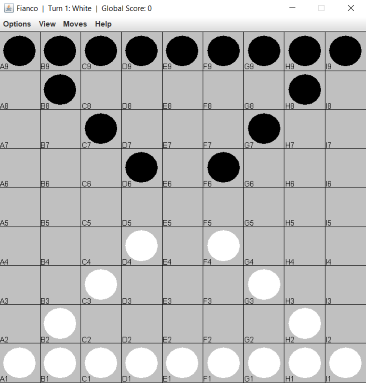

# Fianco

A minimal Java-based [Fianco](http://www.di.fc.ul.pt/~jpn/gv/fianco.htm) implementation.

### Rules

Players take turns moving their stones.
Each turn a player must move one of their stones.
A stone may:
- Move forwards or sideways to an adjacent empty square.
- Capture by jumping diagonally forward over an enemy stone, landing on an empty square.

Capturing is mandatory, but limited to one stone per turn.
A player wins by moving one of their stones to the opposite side of the board.

### Usage

Select a player type for both P1 and P2 in `Main.java`:
 - `HUMAN`: Human operator.
 - `NegaMax`: A minimal NegaMax implementation.
 - `NegaMaxID`: NegaMax with iterative deepening.
 - `NegaMaxPlus`: NegaMax with various heuristics.
 - `NegaMaxQS`: NegaMax with quiescence search.

### Agents

|                       | NegaMax | NegaMaxID | NegaMaxPlus | NegaMaxQS |
|-----------------------|:-------:|:---------:|:-----------:|:---------:|
| NegaMax               |    X    |     X     |      X      |     X     |
| $\alpha\beta$-Pruning |    X    |     X     |      X      |     X     |
| Iterative Deepening   |         |     X     |      X      |     X     |
| Aspiration Search     |         |     X     |      X      |     X     |
| Smart Termination*    |         |     X     |      X      |     X     |
| Transposition Tables  |         |     X     |      X      |     X     |
| Killer Moves          |         |           |      X      |     X     |
| History Heuristic     |         |           |      X      |     X     |
| Fractional Plies      |         |           |             |     X     |
| Quiescence Search     |         |           |             |     X     |

*Smart Termination: uses a simple non-linear function to calculate the time available per move, aiming to spend no more than 10 minutes per game. Search is terminated early if this time limit is hit or if a move is found that guarantees a win.

### About
Developed by Thomas Vroom, Maastricht University (2024).

Fianco is a game by Fred Horn (©1987).
